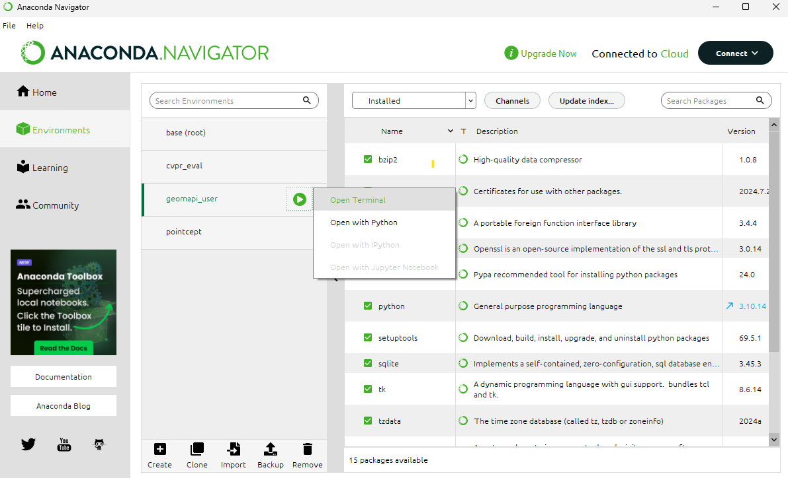

For the installation of the user and development Python environment, we use [Anaconda](https://www.anaconda.com/).
As of now, GEOMAPI requires Python version 3.10 due to dependency restrictions (specifically due to Opend3D). Below, you find a detailed explenation to set up both the user environment and the developer environment 

# User environment
To use geomapi as a package, we will create a Python 3.10 environment and intall geomapi. Open a command line (cmd) and type the following command.

```bash
conda create --name geomapi_user python=3.10
pip install geomapi
```

If you are uncomfortable with the command line, you can use the [Anaconda](https://www.anaconda.com/) UI directly to create the environment. There, you can also open a command line for the package install command.

  


# Developer environment

Developers should create a similar environment.

```bash
conda create --name geomapi_user python=3.10
```
Open Vscode, open a new terminal and navigate to the root of the repository.
Type the following command to install the dependencies.

```bash
pip install -r requirements.txt
```

Note that contributions are subjected to unittests. If these fail, the code will not be updated.