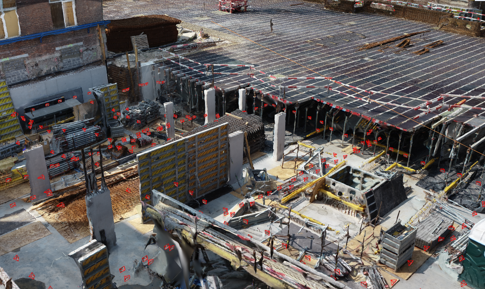

.. Geomapi documentation master file, created by
   sphinx-quickstart on Thu May  5 11:46:39 2022.
   You can adapt this file completely to your liking, but it should at least
   contain the root `toctree` directive.

Welcome to Geomapi's documentation!
===================================

Welcome to GEOMAPI, a Python toolbox designed to enhance the processing of close-range sensing observations such as images and point clouds of the built environment. It specializes in jointly utilizing `Building Information Modeling (BIM) <https://en.wikipedia.org/wiki/Building_information_modeling>`_ and sensory data. To achieve this, GEOMAPI employs `Linked Data (LD) <https://en.wikipedia.org/wiki/Linked_data>`_ to create resources of various popular sensory modalities.

If you want to learn more about GEOMAPI's structure, head over to the  `Getting started <testcases/Getting started>`_ section. Similarly, you can check out the `Ontology <testcases/Ontology>`_ to better understand the data management. If you're interested in viewing real test cases solved with GEOMAPI code, visit the `TEST CASES <testcases/alignmenttools>`_ section.

This `Open-Source <https://github.com/KU-Leuven-Geomatics/geomapi>`_ API is the work of the `GEOMATICS <https://iiw.kuleuven.be/onderzoek/geomatics>`_ research group at KU Leuven, Belgium. If you want to collaborate, visit the team section and let us know.

.. toctree::
   :maxdepth: 1
   :caption: Information:

   information/getting started

   information/ontology

.. toctree::
   :maxdepth: 1
   :caption: API Reference   

   geomapi/geomapi.nodes

   geomapi/geomapi.utils

   geomapi/geomapi.tools

.. toctree::
   :maxdepth: 1
   :caption: Tutorial:

   tutorial/tutorial_nodes

   tutorial/tutorial_geometrynodes

   tutorial/tutorial_meshnodes

   tutorial/tutorial_pointcloudnodes

   tutorial/tutorial_bimnodes

   tutorial/tutorial_imagenodes

   tutorial/tutorial_sessionnodes

   tutorial/tutorial_node_selection

.. toctree::
   :maxdepth: 1
   :caption: Test Cases:

   testcases/alignmenttools
   
   testcases/combinationtools

   testcases/site_progress

   testcases/validationtools

   testcases/volume_calculation

.. toctree::
   :maxdepth: 1
   :caption: Development:

   development/packaging

   development/ontology creation

   development/testcase creation

.. toctree::
   :maxdepth: 1
   :caption: Contribution

   team/team

Please do refer to the following publication when using GEOMAPI in your projects. 

.. code-block:: bibtex
    :linenos:

    @article{GEOMAPI,
        author = {Bassier, M. and Vermandere, J. and De Geyter, S. and De Winter, H. and Bartczak, E.},
        doi = {accepted},
        issn = {0926-580},
        journal = {Automation in Construction},
        keywords = {3D Reconstruction, Geomatics, Semantic Web Technologies, Construction, Remote sensing, BIM, Point clouds, Photogrammetry},
        pages = {pp. 1--38},
        publisher = {Elsevier},
        title = {{GEOMAPI: Processing 3D data with semantic web technologies}},
        url = {Accepted},
        volume = {X},
        year = {2024}
    }

.. Indices and tables
.. ==================

.. * :ref:`genindex`
.. * :ref:`modindex`
.. * :ref:`search`
