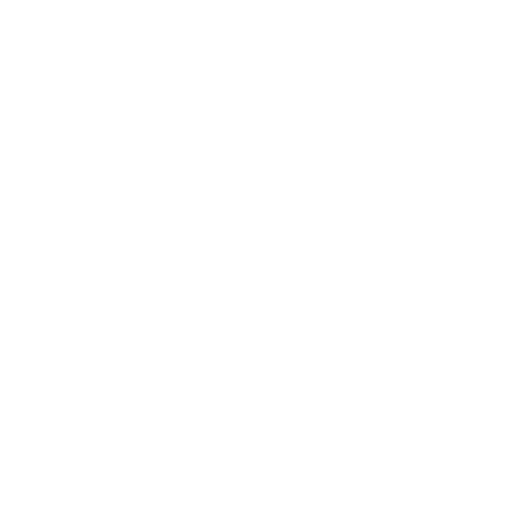
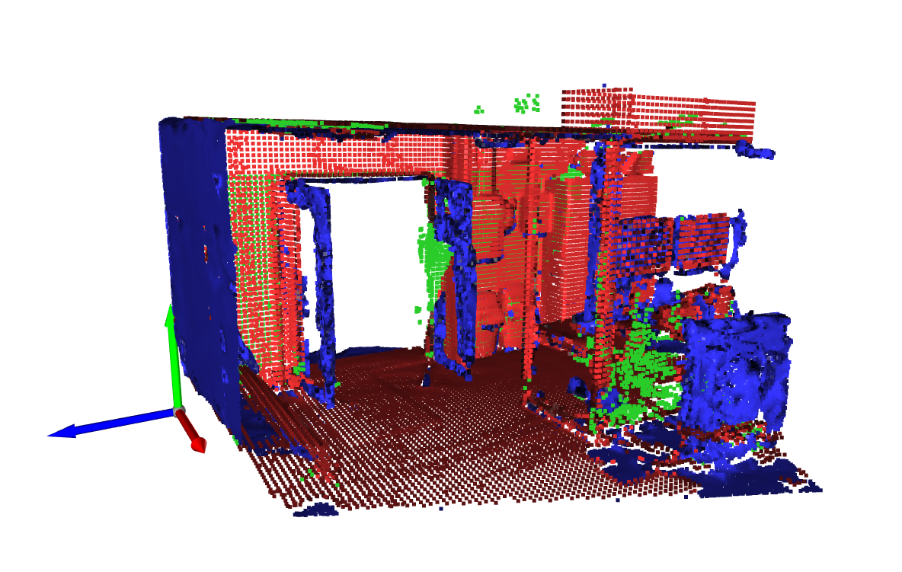
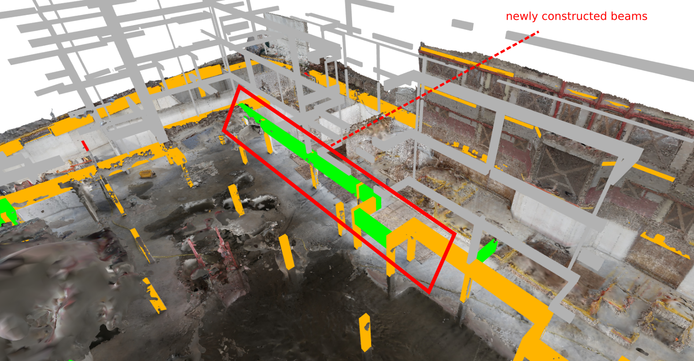
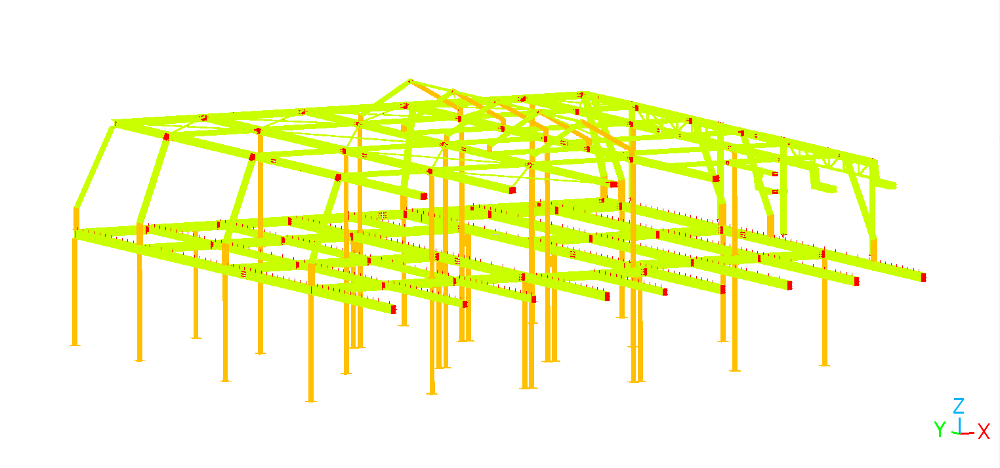

# Geomapi 101
Everything you need to know to get started with geomapi
<!-- _header:  -->


## What is Geomapi?

Python package to better **organise** and **manage** your data.

## Why use Geomapi?

- Standardise data storage
- Improve collaboration
- Use provided utilities & tools

## How to use Geomapi?

Simply add it to your python project:
```bash
> pip install geomapi
```

```py
import geomapi
```

## Data Management
How to manage the data

### RDF Data Storage

- Remote sensing data is very large and slow
- Use metadata, stored next to the resources in a standard format `.ttl`


```ttl
<file:///IMG_7257> a v4d:ImageNode;
    v4d:name "IMG_7257";
    v4d:path "IMG\\IMG_7257.JPG";
    exif:imageHeight 3744;
    exif:imageWidth 5616;
```

### Creating Data

- Creating nodes from resources
```py
image = cv2.read("IMG_7257.JPG")
myImageNode = ImageNode(resource = image)
```
- You can also use: name, path,...

### Reading Data

- Read the `.ttl` file as a `geomapi.nodes.SessionNode()`
```py
session = SessionNode(graphPath = "file.ttl")
```

## Cool Tools

### Alignment Tools
- Align 2 different datasets
- Different space, time & sensor

### Combination Tools
- Combine 2 different datasets
- Only change the updated parts

### Progress Tools
- detect changes throughout time


### Validation Tools
- Validate the BIM model using remote sensing data



### Make your own tools

- Use the core framework to base your code on
- Easy code sharing 


## Conclusion

Use Geomapi to:
- Standardise your data storage
- Use a variety of utils and tools to speed up your workflow
- Build upon a great foundation for better collaboration

## Full documentation

 
 
 https://geomatics.pages.gitlab.kuleuven.be/research-projects/geomapi/

