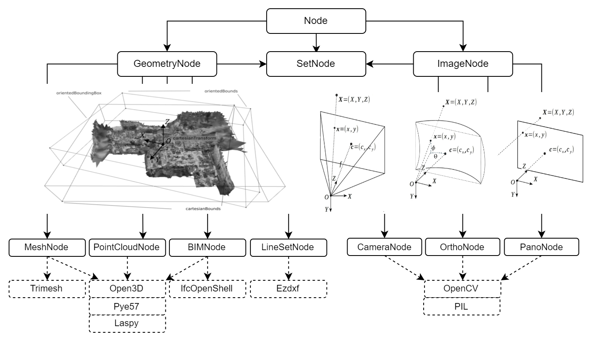
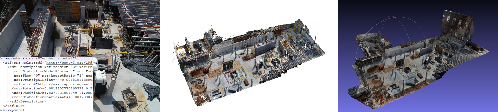
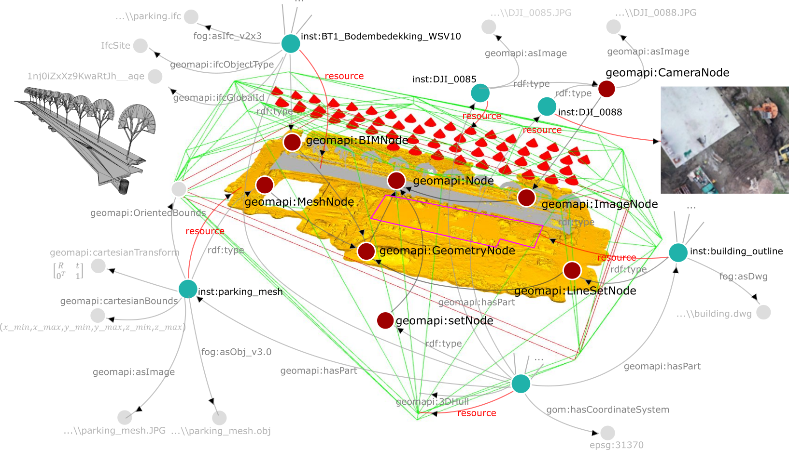

# Getting Started

GEOMAPI manages close-range sensing resources like images and point clouds. It greatly expands the functionality of Open Source projects such as OpenCV and Open3D to create homogeneous and easy to use resources.

## Installation

You will need a python environment (3.7 $\leq$ x $\leq$ 3.10) as Open3D currently doesn't support python $\leq$ 3.11 (due to Open3D dependencies). Use the package manager [pip](https://pypi.org/project/geomapi) to install `geomapi`.

```bash
conda create --name geomapi_user python=3.10
conda activate geomapi_user
pip install geomapi
```

# Creating your first node
a Node is a unit that stores both data and metadata from close-range sensing data. They handle different types of data, like point clouds or images, and they contain detailed information such as location, shape, and relevant properties. This structure helps in efficient querying and analysis of the data.




## Initialisation

Consider the following nodes from the testfiles, built from either a path, a data resource or piece of metadata. Additionally, we can build nodes from [Linked Data](https://en.wikipedia.org/wiki/Linked_data) Graphs!

```py
from geomapi.nodes import ImageNode, PointCloudNode, MeshNode, BIMNode, Node
pcd=o3d.io.read_point_cloud('../tests/testfiles/pcd/parking.pcd')
pcdNode = PointCloudNode(resource=pcd) # built from resource or data
meshNode= MeshNode (path='../tests/testfiles/mesh/parking.obj') # .stl and .obj are supported
imgNode=ImageNode(xmpPath='../tests/testfiles/img/DJI_0085.xmp') # .xmp contains pose information from CapturingReality software. MetaShape .xml is also supported.
bimNodes=tl.graph_path_to_nodes('../tests/testfiles/graphs/graph.ttl') #loads nodes from a graph file representing an IFCfile with BIM objects.
```
  

As you can see, each Node inherits the Base Node properties so they can be created in a very similar way. Look at the [Node Tutorial](../tutorial/tutorial_nodes.ipynb) notebook to learn more about how to create and use nodes.

## Functionality
The cool thing about these Nodes is that they can be jointly querried. We can find neighbouring nodes way faster by not using the actual data!

```py
import geomapi.tools as tl
tl.select_nodes_k_nearest_neighbors(pcdNode,[meshNode,imgNode,bimNodes],k=1) #selects the k nearest neighbors of a point cloud node from a list of nodes

([<geomapi.nodes.meshnode.MeshNode at 0x1d6ea7c2170>], DoubleVector[2.09905]) # the meshNode is the closest Node 2m away!
```

GEOMAPI divides functions into three layers.
1. [**Utilities**](../tutorial/tutorial_functionality.ipynb): Base functions for point clouds and images that support the Node system
```py
import geomapi.utils as ut
from geomapi.utils import geometryutils as gmu
```
2. [**Nodes**](../tutorial/tutorial_functionality.ipynb): Node specific functions such as projecting rays from an ImageNode in 3D, mutations, surface sampling, etc.
```py
imgNode=ImageNode(xmlPath='../tests/testfiles/img/road.xml', path='../tests/testfiles/img/101_0367_0007.JPG') 
imgNode.create_rays(imagePoints=[[0,0],[0,1],[1,0],[1,1]],depths=25) #creates rays from image points
```
3. [**Tools**](../tutorial/tutorial_functionality.ipynb): Functions that combine nodes for distance calculations, intersections, analyses, etc.
```py
import geomapi.tools as tl
import geomapi.tools.progresstools as pgt
pgt.project_pcd_to_rgbd_images (pointClouds, imgNodes, depth_max=15)
```
Each subpackage is abriviated using the first letter of each word: validationtools -> vt. If there are doubles, insert the first different letter in between: geometryutils -> gmu. Packages with a single word become the first letter + the first constant: tools -> tl, utils -> ut.

## Ontology
GEOMAPI works with Linked Data to define the concepts, relationships and functions. At its core, it uses the in-house [geomapi ontology](https://github.com/KU-Leuven-Geomatics/geomapi/blob/main/geomapi/ontology/geomapi_ontology.ttl) that is linked to specific functions within the GEOMAPI toolbox. For instance, every Node has an [RDF Graph](https://en.wikipedia.org/wiki/Resource_Description_Framework) mimic, allowing to interact with any online resource.

Visit the [Ontology Tutorial](../tutorial/tutorial_ontology.md) to learn more about the ontology and what we do with it.



# Test cases

Check out the [testcases](../testcases/) to learn how we used this package in real applications, such as tracking progress of construction sites using both images and point clouds. You can use it as inspiration for your own projects!

# Development

Check out the [Development](../development/) section if you want to participate in the development of GEOMAPI.

# Contribution

This Open Source API is made possible by the efforts by the [KU Leuven Geomatics](https://iiw.kuleuven.be/onderzoek/geomatics). Please [cite](https://www.sciencedirect.com/science/article/pii/S0926580524001900) us to support our research and let us know what you do with GEOMAPI!

Visit the [Team's page](../team/team.md) if you want to learn more about the developers. 

```
@article{GEOMAPI,
            title = {GEOMAPI: Processing close-range sensing data of construction scenes with semantic web technologies},
            journal = {Automation in Construction},
            volume = {164},
            pages = {105454},
            year = {2024},
            issn = {0926-5805},
            doi = {https://doi.org/10.1016/j.autcon.2024.105454},
            url = {https://www.sciencedirect.com/science/article/pii/S0926580524001900},
            author = {Maarten Bassier and Jelle Vermandere and Sam De Geyter and Heinder De Winter},
            keywords = {Geomatics, Semantic Web Technologies, Construction, Close-range sensing, BIM, Point clouds, Photogrammetry}
            }
```
