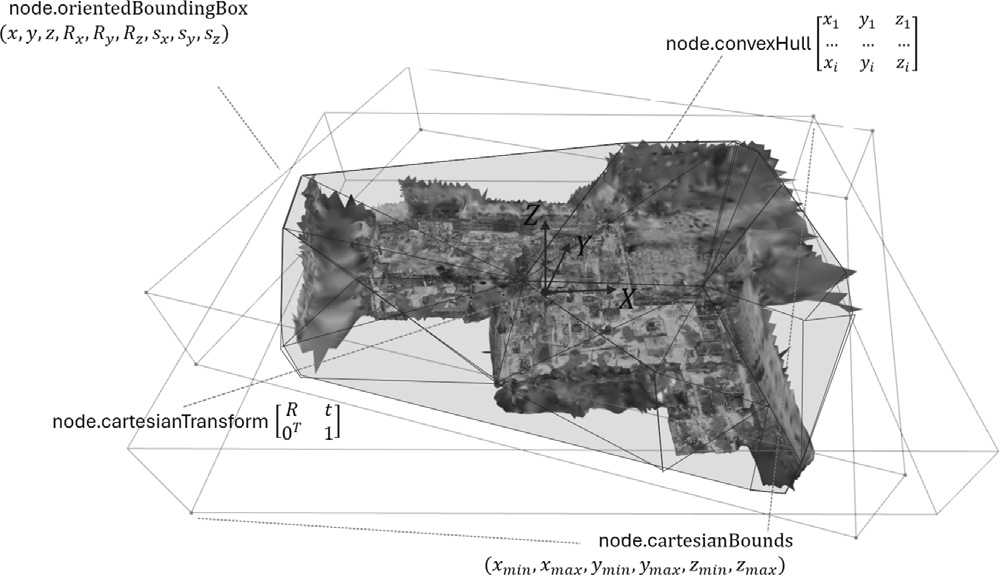
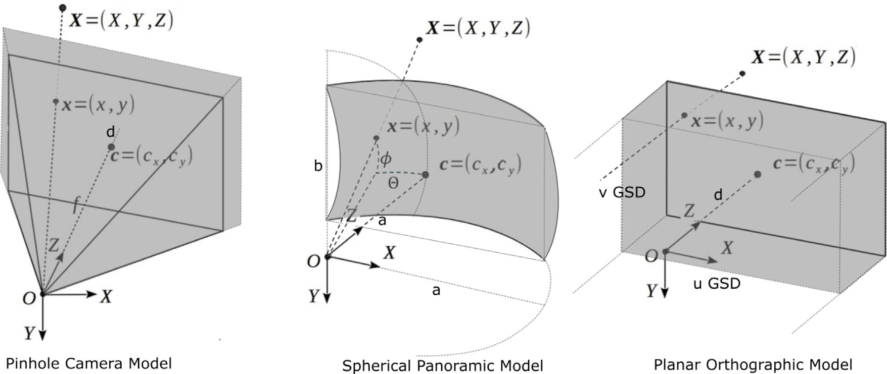

# Nodes

GEOMAPI5 manage geospatial data as linked data resources, represented as RDF Graphs. The framework inputs include various types of close-range sensing data, such as geolocated imagery, point clouds, polygonal meshes, as well as construction data comprising BIM and CAD geometries.

From these inputs, a series of metadata is extracted and serialized into RDF Graphs, that are compatible with efficient retrieval functions. 

## Node
GEOMAPI currently defines a general Node type with seven actual data classes governed by two supertypes, one for geometric inputs and one for image inputs. Each data class inherits functionality from the supertypes and extracts the metadata of its respective resource.

Nodes store the following metric information in accordance with the conceptual framework outlined in the [OpenLabel Standard](https://www.asam.net/index.php?eID=dumpFile&t=f&f=3876&token=413e8c85031ae64cc35cf42d0768627514868b2f), including:

- cartesianTransform: pose information T = \[
\begin{matrix}
R & t \\
0^T & 1
\end{matrix}
\].
- cartesianBounds: tupple with (xmin, xmax, ymin, ymax, zmin, zmax) 
- The oriented Bounding Box is stored as a 9 x 1 matrix (x, y, z, Rx(θ), Ry(φ), Rz(ψ), sx, sy, sz) which includes:
  - The location (x, y, z)
  - The rotation around the three cardinal axes applied in the order $R_z$ (yaw), $R_y$ (pitch), $R_x$ (roll)
  - The size (sx, sy, sz) in each direction.
- The convex Hull is also stored using its bounding points as an nx3 matrix:
\[
\begin{matrix}
x1 & y1 & z1 \\
\vdots & \vdots & \vdots \\
xi & yi & zi
\end{matrix}
\]

Non-metric information includes:
- The timestamp
- The RDF URI
- The type of coordinate system
- The path to the resource
- Additional resource-specific details such as image width.


```py
from geomapi.nodes import Node
node= Node(subject='myNode') # empty node with a subject
node= Node(graph=rdflib.Graph()) # node with a subject

node= MeshNode (path='../tests/testfiles/mesh/parking.obj') # .stl and .obj are supported
node=tl.graph_path_to_nodes('../tests/testfiles/graphs/graph.ttl') #loads nodes from a graph file representing an IFCfile with BIM objects.
```

## Geometry Nodes
The geometry classes in GEOMAPI specify data and metadata for resources characterized by exact geometric properties, i.e., those whose boundaries are precisely defined by their geometric resource. Currently, we include

1. **PointCloudNode**: For point cloud data, capturing detailed spatial information from LiDAR and photogrammetry.
2. **MeshNode**: For polygonal meshes, representing 3D surfaces and structures.
3. **BIMNode**: For Building Information Models, linking to detailed architectural and structural data.
4. **LineSetNode**: For CAD geometries, representing lines and simple geometric shapes.



```py
from geomapi.nodes import  PointCloudNode, MeshNode, BIMNode
pcd=o3d.io.read_point_cloud('../tests/testfiles/pcd/parking.pcd')
pcdNode = PointCloudNode(resource=pcd) # built from resource or data
meshNode= MeshNode (path='../tests/testfiles/mesh/parking.obj') # .stl and .obj are supported
bimNodes=tl.graph_path_to_nodes('../tests/testfiles/graphs/graph.ttl') #loads nodes from a graph file representing an IFCfile with BIM objects.
```


## Image Nodes
The image classes in GEOMAPI are designed to define data and metadata for geolocated image-based resources, such as those processed by Structure-from-Motion (SfM) pipelines or Mobile Mapping Systems (MMS).

1. **CameraNode**: For conventional imagery, capturing images from standard cameras.
2. **PanoNode**: For panoramic imagery, capturing 360-degree views.
3. **OrthoNode**: For orthomosaic imagery, representing top-down images often used in mapping and surveying.



```py
from geomapi.nodes import ImageNode, PointCloudNode, MeshNode, BIMNode, Node
pcd=o3d.io.read_point_cloud('../tests/testfiles/pcd/parking.pcd')
pcdNode = PointCloudNode(resource=pcd) # built from resource or data
meshNode= MeshNode (path='../tests/testfiles/mesh/parking.obj') # .stl and .obj are supported
imgNode=ImageNode(xmpPath='../tests/testfiles/img/DJI_0085.xmp') # .xmp contains pose information from CapturingReality software. MetaShape .xml is also supported.
bimNodes=tl.graph_path_to_nodes('../tests/testfiles/graphs/graph.ttl') #loads nodes from a graph file representing an IFCfile with BIM objects.
```