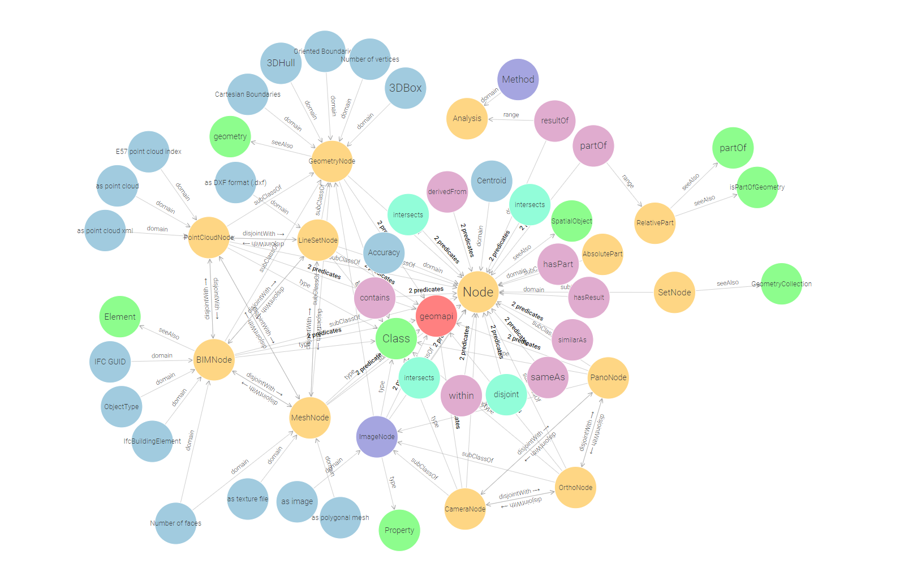
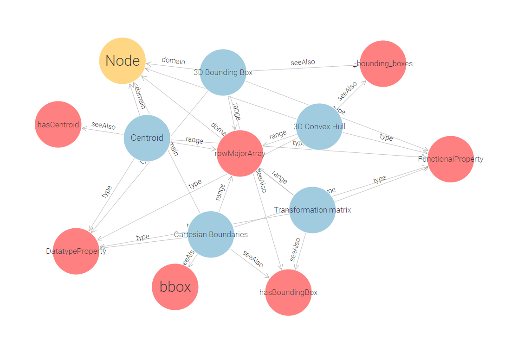
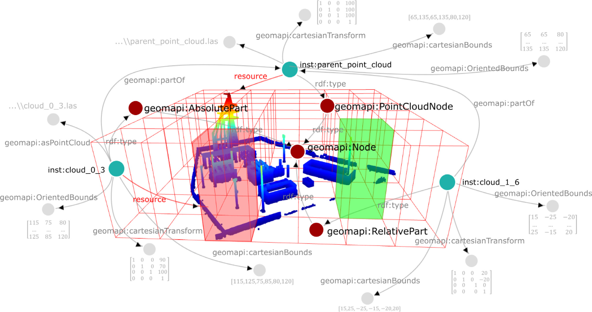
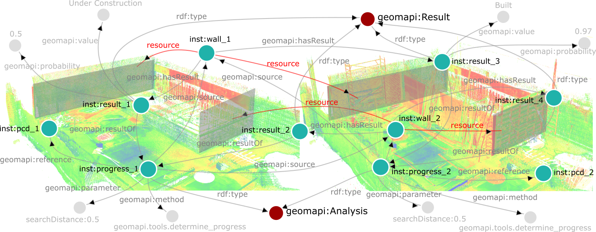

# Ontology
The [geomapi ontology](http://www.w3id.org/geomapi) defines (1) the close-range sensing nodes with the appropriate metric and non-metric metadata, (2) the relationships to efficiently retrieve the geospatial resources and (3) define the concepts to store multi-modal and multi-temporal analyses and results. The ontology reuses existing concepts wherever possible (see Table) and is validated through GraphDB.

### Table 2
Listing of the used existing ontologies and prototype V4D ontology modules.

| Prefix | Namespace |
|--------|-----------|
| **General** | |
| [rdf](http://www.w3.org/1999/02/22-rdf-syntax-ns#) | http://www.w3.org/1999/02/22-rdf-syntax-ns# |
| [rdfs](http://www.w3.org/2000/01/rdf-schema#) | http://www.w3.org/2000/01/rdf-schema# |
| [owl](http://www.w3.org/2002/07/owl#) | http://www.w3.org/2002/07/owl# |
| [xsd](http://www.w3.org/2001/XMLSchema#) | http://www.w3.org/2001/XMLSchema# |
| [dcterms](http://purl.org/dc/terms/) | http://purl.org/dc/terms/ |
| [voaf](http://purl.org/vocommons/voaf#) | http://purl.org/vocommons/voaf# |
| [vann](http://purl.org/vocab/vann/) | http://purl.org/vocab/vann/ |
| [dbp](http://dbpedia.org/ontology/) | http://dbpedia.org/ontology/ |
| **Geometry** | |
| [geo](http://www.opengis.net/ont/geosparql#) | http://www.opengis.net/ont/geosparql# |
| [bot](https://w3id.org/bot#) | https://w3id.org/bot# |
| [bpo](https://w3id.org/bpo#) | https://w3id.org/bpo# |
| [omg](https://w3id.org/omg#) | https://w3id.org/omg# |
| [fog](https://w3id.org/fog#) | https://w3id.org/fog# |
| [geom](http://ontology.eil.utoronto.ca/icity/Geom/) | http://ontology.eil.utoronto.ca/icity/Geom/ |
| [ifc](https://standards.buildingsmart.org/IFC/DEV/IFC4/ADD2_TC1/OWL) | https://standards.buildingsmart.org/IFC/DEV/IFC4/ADD2_TC1/OWL |
| [dggs](https://w3id.org/dggs/as) | https://w3id.org/dggs/as |
| **Texture** | |
| [xcr](http://www.w3.org/1999/02/22-rdf-syntax-ns#) | http://www.w3.org/1999/02/22-rdf-syntax-ns# |
| [exif](http://www.w3.org/2003/12/exif/ns#) | http://www.w3.org/2003/12/exif/ns# |
| **Coordinate systems** | |
| [gom](https://w3id.org/gom#) | https://w3id.org/gom# |
| [epsg](http://www.opengis.net/def/crs/EPSG/0/) | http://www.opengis.net/def/crs/EPSG/0/ |

## Nodes
GEOMAPI extends these concepts by standardizing the metric information. gom:rowMajorArray and gom:columnMajorArray datatypes are used as base properties. 
Note that while all nodes use the same concept, their implementation might differ. For instance, the `3D Convex Hull` of a point cloud is defined by the alpha shape of the point set, while for an ImageNode, this is the viewing frustrum up to a default depth (30m). Additionally, these base parameters are defined to be both `owl:DatatypeProperty` and `owl:FunctionalProperty` meaning that they contain metric information that is unique to the URI. We might revise this later on when we deal with observation uncertainties, but for now, we only allow 1 `geomapi:cartensianTransform` for a resource at a time. 

For building information, GEOMAPI links to the [BOT](https://w3id.org/bot#), PRODUCT, and [IFCOWL](https://standards.buildingsmart.org/IFC/DEV/IFC4/ADD2_TC1/OWL) ontologies, focusing on shape and appearance data while referring to other ontologies for detailed semantic information. 

For image data, it incorporates elements from Capturing Reality’s [xcr](http://www.w3.org/1999/02/22-rdf-syntax-ns#) ontology and the [exif](http://www.w3.org/2003/12/exif/ns#) standard, using [gom](https://w3id.org/gom#) terminology for coordinate systems.

## Relationships

**Vertical**, **horizontal** and **typological** relationships are defined in the ontology. Vertical relationships include the `SetNode`, a subclass of `Node` that serves as a collector for multiple data nodes, and `geomapi:partOf`, linking subsets of data nodes to parent nodes. The `SetNode` allows for efficient querying by grouping related nodes and updating attributes based on its parts. The `geomapi:partOf` relationship distinguishes between `AbsolutePart`, which duplicates data for mutations, and `RelativePart`, which inherits the parent’s metadata.

**Horizontal** relationships, such as `geomapi:derivedFrom` and `geomapi:similarAs`, describe similarities between sibling nodes, indicating shared or similar content. These relationships reduce the complexity of graph querying and are essential for efficient data management.

Lastly, **topological** relationships such as adjacency, overlap, and intersection speed up querying.

## Analyses
GEOMAPI defines classes for analysis and results to store and reuse evaluations, optimizing information processing. Rather than integrating every analysis into a single Graph, GEOMAPI uses a base Graph with resource Nodes and topological relations, supplemented by separate analysis Graphs tailored to specific applications. An Analysis Node can utilize data Nodes and previous analyses as sources, producing Result Nodes linked to relevant data Nodes. Shared results reduce redundancy by linking to the same Result Node. Analysis parameters are defined as DataTypes to avoid clutter, given the relatively limited number of analyses compared to results or data Nodes.

## Querying
GEOMAPI utilizes RDF Graphs to query, evaluate, merge, and transform close-range sensing observations through a query-mutation-operation framework. Queries are standardized using SPARQL for RDF pattern matching and enhanced with GeoSPARQL extension functions for geospatial operations. By optimizing query methods with kd-trees, GEOMAPI significantly reduces combination complexity from $O(n^3)$ to $O(n \log n)$. Mutation methods are developed to transform resources between data types, including texture projection onto 3D geometries, point cloud to mesh conversion, and reverse processes, ensuring efficient handling of geospatial data and supporting various query requirements.

GEOMAPI supports versatile data type transformations, converting polygonal meshes into textures or point clouds using mutation methods. These capabilities enhance the framework's versatility in geospatial information processing. Extended GeoSPARQL queries enable geospatial operations, including set theory, cropping, and topological relationships. These operations are integrated with RDF definitions, allowing efficient query execution by targeting metadata first to narrow down the search space. Resources are then loaded into memory for manipulation. This approach ensures efficient processing, with many queries executed using metadata alone, facilitating complex geospatial operations.

